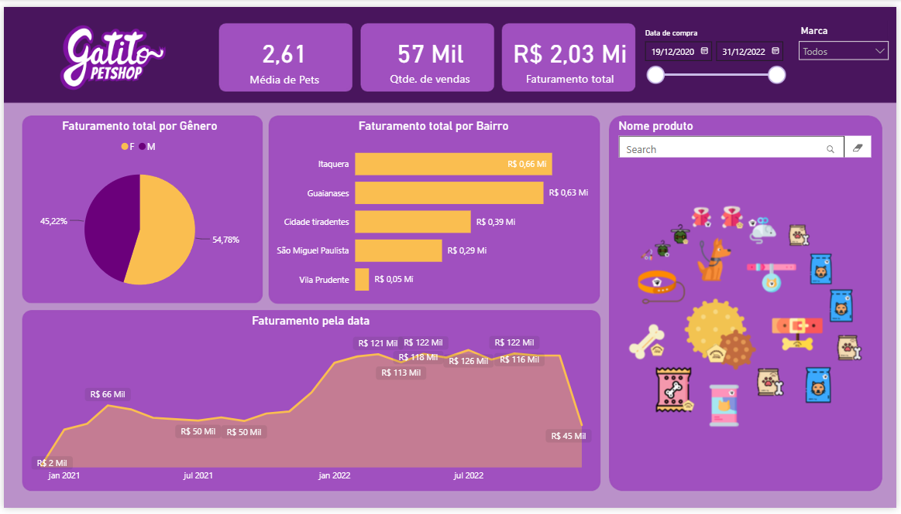

# 📊 Projeto de Aprendizado: Modelagem de Dados e ETL com Power BI

## 📌 Sobre o Projeto
Este é um projeto prático guiado desenvolvido durante o curso **Power BI Desktop: construindo meu primeiro dashboard** da **Alura**. 

Embora o artefato final seja um dashboard, o principal objetivo deste repositório é documentar e consolidar meus estudos na camada de infraestrutura do BI: **processo de ETL (Extração, Transformação e Carga)** e **Modelagem Dimensional de Dados**, habilidades essenciais para a Engenharia de Dados.

## ⚙️ Arquitetura e Processamento de Dados

Para que o dashboard tivesse uma boa performance e os dados fossem confiáveis, as seguintes etapas técnicas foram aplicadas:

### 1. Extração e Transformação (Power Query / Linguagem M)
* **Origem dos dados:** [CSV] contendo [19.484] mil linhas.
* **Limpeza:** Tratamento de valores nulos, remoção de duplicatas e padronização de tipos de dados.
* **Transformação:** Criação de colunas condicionais e mesclagem de consultas para enriquecimento da base original.

### 2. Modelagem de Dados
* **Arquitetura:** Construção de um modelo relacional baseado em **Star Schema** (Esquema Estrela), otimizando a leitura dos dados.
* **Tabelas:**
 * **Fato:** `Vendas` - Centralizando as métricas quantitativas e chaves estrangeiras.
  * **Dimensões:** `Clientes, Produtos` - Para garantir a correta filtragem e categorização.
* **Relacionamentos:** Relacionamentos 1:N (Um para Muitos) estabelecidos, garantindo a integridade referencial sem ambiguidades no modelo.

## 📈 Resultado Visual

Abaixo está uma prévia da camada de visualização consumindo o modelo de dados otimizado:

## 🚀 Como visualizar o projeto

1. Faça o download do arquivo `DashboardPetshop.bix` presente neste repositório.
2. É necessário ter o [Power BI Desktop](https://powerbi.microsoft.com/desktop/) instalado na sua máquina.
3. Abra o arquivo para navegar pelo modelo de dados (aba Modelo) e pelas transformações (Power Query).

---
*Este repositório faz parte do meu portfólio de estudos contínuos na jornada de **Engenharia de Dados**.*
